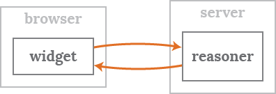

# Everyone should get easy access to reasoning
[Reasoning](http://n3.restdesc.org/) is the powerful mechanism to draw conclusions from facts.
The [Semantic Web](http://www.w3.org/2001/sw/) contains vast amounts of data,
which makes it an interesting source to use with one of the several available [reasoners](http://en.wikipedia.org/wiki/Semantic_reasoner).

However, reasoners can feel complicated,
making them hard for frequent use.
Therefore, this initiative aims to provide a **user-friendly reasoning experience** in current Web browsers and applications.

For a **live demo**, check out an [online reasoning example](http://n3.restdesc.org/rules/generalized-rules/).

# Handy client widgets use smart server tools
Reasoning in Web browsers consists of two parts:

- a **browser widget** offering an intuitive graphical interface
- a **reasoner server** that performs the actual reasoning task

The widget and the reasoner communicate to deliver the reasoning experience.

<figure>
  
  <figcaption>A browser widget talks with a reasoner on the server.</figcaption>
</figure>

# We create free and open reasoning resources
We strive to make reasoning freely available for everyone.  
This is why we develop several **open source projects**:

- [EyeClient](https://github.com/RubenVerborgh/EyeClient) is a browser widget for the EYE reasoner server.
- [EyeServer](https://github.com/RubenVerborgh/EyeServer) is a server for the EYE reasoner.
- [node-n3](https://github.com/RubenVerborgh/node-n3) is an N3 library for JavaScript.

Furthermore, we create **free interactive courses** on reasoning:

- [Semantic Web Reasoning with EYE](http://n3.restdesc.org/) is a comprehensive introduction.
